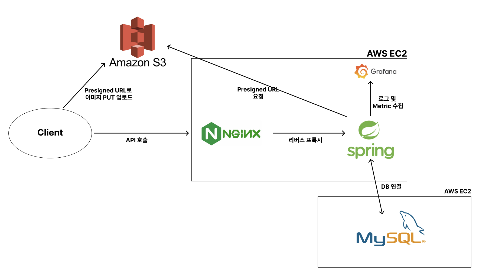

  

> **공식 서비스 링크**: [https://codemonster.site](https://codemonster.site)

---

### 1. 프로젝트 소개

#### 1.1. 개발배경 및 필요성

정보컴퓨터공학부 소속 동아리 APPTIVE 활동 중, 많은 개발자들이 코딩 테스트 준비를 부담스러워하는 현실을 목격하였고, 이를 해결하기 위한 서비스로 코드몬스터를 기획하게 되었습니다.  
스터디는 많지만, 풀이 공유보다는 인증에 초점이 맞춰진 비효율적인 구조가 많았고, 개인 블로그는 꾸준한 기록과 상호작용이 부족했습니다.  
 
이러한 문제를 해결하기 위해 **"기록"과 "공유"**, 그리고 "데이터 기반 개선"을 핵심 키워드로 하는 플랫폼을 만들고자 했습니다.

#### 1.2. 개발 목표 및 주요 내용

- 주어진 날짜에 문제를 풀고 풀이를 기록하는 **커뮤니티 기반 스터디 플랫폼** 구현  
- **사용자 행동 데이터 수집 및 분석**을 통해 서비스 전반의 UX 및 기능 고도화  
- 사용자에게 실질적인 성장 동기를 부여하는 구조 설계 (추천 문제, 회고 문화 등)
- **트래픽 집중 시간대 분석**, **성능 병목 지점 파악**, **API 성능 개선**  

#### 1.3. 세부내용

- 사용자 요구사항 분석: 인터뷰 및 사용성 테스트  
- 로그 기반 분석: Amplitude, GA 활용  
- 성능 개선 계획: 트래픽 집중 시간대 서버 부하 완화 (캐싱, 비동기화, 분산 처리)  
- 개발환경:  
   - **Frontend**: React.js  
   - **Backend**: Spring Boot  
   - **로그 수집 및 시각화**: Grafana, Loki, Prometheus
   - **배포 및 운영**: AWS, Nginx

#### 1.4. 기존 서비스 대비 차별성

- 블로그 기반 학습 → **개별 기록 중심 → 동기부여 약함**  
- 코드몬스터 → **팀 기반의 공유와 회고 중심**, 사용자 중심의 경험 개선  
- 데이터 기반 개선 전략을 통해 실시간 피드백과 UX 고도화

#### 1.5. 사회적가치 도입 계획

- 정규 수업 외에도 꾸준히 코딩 테스트를 준비할 수 있는 **보조 학습 플랫폼** 제공  
- **개발자 커뮤니티, 대학 동아리**와 연계하여 팀 단위 학습 환경 제공  
- 향후 **LLM 기반 추천/회고 시스템** 도입으로 개인 맞춤형 학습 방향 제시  
- 데이터 분석 기반 문제 해결로 **디지털 리터러시 향상 및 자기주도적 학습 유도**

---

### 2. 상세설계

#### 2.1. 시스템 구성도

  

#### 2.2. 사용 기술

| 파트 | 기술 및 버전 |
|------|---------------|
| Frontend | React.js |
| Backend | Spring Boot |
| 로그 수집 및 분석 | Grafana, Loki, Prometheus |
| 배포 및 운영 | AWS (EC2, S3, ECS), Nginx |

---

### 3. 개발결과

#### 3.1. 전체 시스템 흐름도

> TODO: 시스템 전체 흐름도를 이미지로 첨부하거나 설명으로 작성

#### 3.2. 기능설명

> TODO: 다른 주요 페이지도 같은 형식으로 추가
> TODO: 시연 영상도 삽입

#### 3.3. 기능명세서

> TODO: 기능명세서 링크 혹은 첨부 (Notion, Google Sheets, PDF 등)

#### 3.4. 디렉토리 구조

> TODO: 실제 디렉토리 구조에 맞게 수정

---

### 4. 설치 및 사용 방법

---

### 5. 소개 및 시연 영상

> TODO: 시연 영상을 YouTube에 업로드 후 링크 삽입  

---

### 6. 팀 소개

| 이름 | 역할 | 소개 |
|------|------|------|
| 👩‍💻 기획자/디자이너 | 서비스 기획 및 UI/UX 설계 | 다양한 도메인 경험, UX 기반 문제 해결 |
| 👨‍💻 프론트엔드 개발자 | React 기반 개발 | KakaoTechCampus 수료, 3회 이상 프로젝트 |
| 👨‍💻 백엔드 개발자 | Spring 기반 개발, DevOps | 실서비스 운영, AWS+CI/CD 경험 다수 |

---

### 7. 해커톤 참여 후기

> TODO: 팀원별로 참여 후기를 작성해주세요.  
